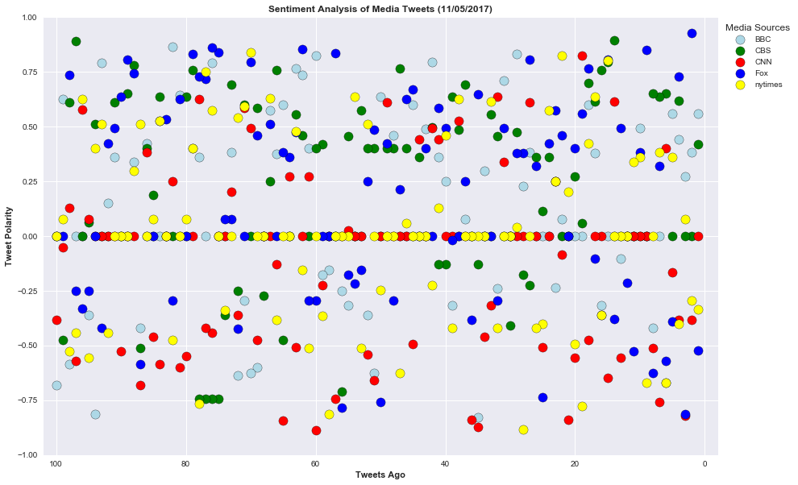
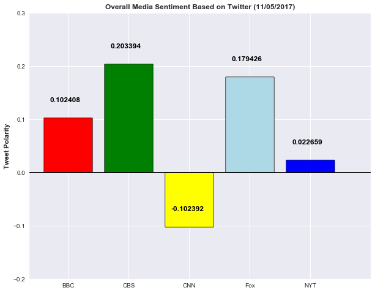

## News Mood

In this assignment, you'll create a Python script to perform a sentiment analysis of the Twitter activity of various news oulets, and to present your findings visually.

Your final output should provide a visualized summary of the sentiments expressed in Tweets sent out by the following news organizations: __BBC, CBS, CNN, Fox, and New York times__.


The first plot will be and/or feature the following:

* Be a scatter plot of sentiments of the last __100__ tweets sent out by each news organization, ranging from -1.0 to 1.0, where a score of 0 expresses a neutral sentiment, -1 the most negative sentiment possible, and +1 the most positive sentiment possible.
* Each plot point will reflect the _compound_ sentiment of a tweet.
* Sort each plot point by its relative timestamp.

The second plot will be a bar plot visualizing the _overall_ sentiments of the last 100 tweets from each organization. For this plot, you will again aggregate the compound sentiments analyzed by VADER.

The tools of the trade you will need for your task as a data analyst include the following: tweepy, pandas, matplotlib, seaborn, textblob, and VADER.

Your final Jupyter notebook must:

* Pull last 100 tweets from each outlet.
* Perform a sentiment analysis with the compound, positive, neutral, and negative scoring for each tweet. 
* Pull into a DataFrame the tweet's source acount, its text, its date, and its compound, positive, neutral, and negative sentiment scores.
* Export the data in the DataFrame into a CSV file.
* Save PNG images for each plot.

As final considerations:

* Use the Matplotlib and Seaborn libraries.
* Include a written description of three observable trends based on the data. 
* Include proper labeling of your plots, including plot titles (with date of analysis) and axes labels.
* Include an exported markdown version of your Notebook called  `README.md` in your GitHub repository.  


```python
# Dependencies
import tweepy
import json
import numpy as np
import matplotlib.pyplot as plt
import pandas as pd
import seaborn as sns
from vaderSentiment.vaderSentiment import SentimentIntensityAnalyzer
analyzer = SentimentIntensityAnalyzer()
import time
```


```python
# Twitter API Keys
consumer_key = "IqqOcoOSlCxcEUAuZQY1Kb02L"
consumer_secret = "4ISKPBgy56BXsp7a8Ja639ToJ9xhjeAya13yg3bRU7wnfkL9f3"
access_token = "922955283172876289-OK82xypOTTZsmZnsG2sxZxjVC9wlymW"
access_token_secret = "zyJNP5AaGcAuKuKiNEWiUwiBccWdEWrMawvksujYJigq3"
```


```python
# Setup Tweepy API Authentication
auth = tweepy.OAuthHandler(consumer_key, consumer_secret)
auth.set_access_token(access_token, access_token_secret)
api = tweepy.API(auth, parser=tweepy.parsers.JSONParser())
```


```python
# Target Search Term
news_outlet = ["@BBC", "@CBS", "@CNN", "@Fox", "@nytimes"]
counter = 1
sentiments =[]
```


```python
for outlet in news_outlet:
    public_tweets = api.user_timeline(outlet, count=100)
    tweetnumber = 1       
    for tweet in public_tweets:
        print("Tweet %s: %s" % (counter, tweet["text"]))
        compound = analyzer.polarity_scores(tweet["text"])["compound"]
        pos = analyzer.polarity_scores(tweet["text"])["pos"]
        neu = analyzer.polarity_scores(tweet["text"])["neu"]
        neg = analyzer.polarity_scores(tweet["text"])["neg"]
        tweets_ago = tweetnumber
        sentiments.append({"Media Source": outlet,
                           "Text":tweet["text"],
                           "Date": tweet["created_at"],
                           "Compound": compound,
                           "Positive": pos,
                           "Neutral": neu,
                           "Negative": neg,
                           "Tweet Count": tweetnumber})
        tweetnumber +=1
        counter +=1

```

    Tweet 1: RT @BBCOne: Q: How many tickles does it take to make a squid laugh?
    A: Ten tickles. 
    
    #BluePlanet2 https://t.co/fhKPOUBp5U
    Tweet 2: RT @bbcstrictly: That shock result has left us spinning. RT to show your love for @AstonMerrygold and @JManrara 💖 https://t.co/KJVszLhB2k
    Tweet 3: RT @BBCTwo: Well, you don't see that every day... #RobotWars https://t.co/sLq92M7mqY
    Tweet 4: RT @BBCOne: Can’t beat a good accessory. 👑 #BluePlanet2 https://t.co/mRZZEdwmlO
    Tweet 5: RT @BBCPanorama: Watch our #paradisepapers investigation into the offshore secrets of the rich &amp; famous on iPlayer.  https://t.co/MIH4CMbhZ…
    Tweet 6: RT @BBCBreaking: At least 27 people killed in Texas church shooting, police commissioner in Sutherland Springs tells US media https://t.co/…
    Tweet 7: 🎥 @LouisTheroux meets disaffected former members of the Church of Scientology. #MyScientologyMovie. Tonight at 9pm… https://t.co/5hRLxriwiW
    Tweet 8: When your other half cheats on you with #StrangerThings. 😡 Via @BBCTheSocial. https://t.co/NOpHOfbIKb
    Tweet 9: 😋 Family favourites at their finest. Check out these recipes for 10 absolute classics. 👉 https://t.co/kFD6BsfO6q https://t.co/xw1Q5SYadk
    Tweet 10: Second hand smoke affects our pets too. 🚭🐶 Via @BBCBreakfast. https://t.co/TCdA8m85dm
    Tweet 11: It took more than 1 man on a single night to nearly change the course of British history. 🔥 #BonfireNight.… https://t.co/RnzZm8yh9j
    Tweet 12: 'It's one of those stories you think you know. Then you realise you just don't.'
    
    Do you know the real… https://t.co/M8np5ep1yz
    Tweet 13: 💰🥃 How much would you pay for a cask of rare Scotch whisky? An anonymous buyer in Hong Kong just dropped £285,000.… https://t.co/ZzUInzNqEo
    Tweet 14: #PeakyBlinders series 4 returns to @BBCTwo, Wednesday 15th November at 9pm. https://t.co/lbVlyzhb4p
    Tweet 15: Tonight, #BluePlanet2 makes a groundbreaking journey to the depths of the ocean. 8pm on @BBCOne. 🐟 🐡 🐙… https://t.co/S3gcHqmTMf
    Tweet 16: Moynaq: The port city that lost its water. 💦 Via @BBC_Travel. https://t.co/Qr1ZLExpBb https://t.co/G8QxO8qAZ5
    Tweet 17: Having a bonfire today? 🔥
    Make sure you think about the hedgehogs! Via @BBCSpringwatch.
    
    More 👉… https://t.co/zbHOX6yl9O
    Tweet 18: From wild goats to woodland walks - here are your pictures of beautiful Scotland. 📷 https://t.co/sv03yk0H76 https://t.co/KHKNGXcROU
    Tweet 19: Can @Joe_Sugg zip it for 30s? 
    If chatting is your thing, how about a sponsored silence for #CiN? 
    More ideas here… https://t.co/OPA2UMuuPZ
    Tweet 20: Guy Fawkes: Why do bonfires still burn 400 years on? 🔥 #BonfireNight #GuyFawkesNight. https://t.co/dAKAZY4ZEX https://t.co/lsiivkKSgk
    Tweet 21: 🐙 A group of octopuses were seen taking a leisurely stroll along a Ceredigion beach last Friday night. Via… https://t.co/n3jq0oNT7J
    Tweet 22: 🏙By 2050 70% of the world's population will be living in cities. Time to radically rethink what we want from a city… https://t.co/pz5xleBKWz
    Tweet 23: ⚽️✊ When the boys wouldn't let them play football, these girls took matters into their own hands. Via @BBC100Women. https://t.co/0j68Wbrr3Z
    Tweet 24: .@LindaRobson58, @tomallencomedy, @misJORGIEPORTER &amp; @OreOduba star in @GrumpyLGoodman's Partners in Rhyme:… https://t.co/SLJlz8D01M
    Tweet 25: 🎬 From the new Pixar animation to Oscar-favourite coming-of-age stories, here are 10 films to watch this November.👉… https://t.co/NqtcuUqOXN
    Tweet 26: RT @BBCWthrWatchers: Morning all! Only one way to start our Sunday and that's with a bit of ...
    
    🎆Oooooooooo! 🎆 Aahhhhhhhhhh!🎆 https://t.co…
    Tweet 27: RT @BBCSpringwatch: Stunning capture of puffins at the Isle of May, Scotland. https://t.co/cBWxx9rQav
    Tweet 28: RT @BBCFood: Heading to the fireworks later? Put this in the slow cooker and warm up when you get home https://t.co/EPJfvmFkfS https://t.co…
    Tweet 29: RT @bbcstrictly: Debbie’s Tango gets a remarkable reaction from Craig, and Ruth’s Paso doesn’t quite go to plan. Watch the best bits from #…
    Tweet 30: 🎇🎆 Why do we have Bonfire Night and fireworks displays every November 5 in the UK? https://t.co/lYBHme3LJZ https://t.co/qln8Tk64FN
    Tweet 31: 🥚🍳 Eggs for breakfast anyone? @Nigella_Lawson shares her secret for poached perfection. Via @BBC5Live. https://t.co/vnyAxh4gGU
    Tweet 32: RT @bbcmusic: "What do you think of Chip N Pin House..?" 😆😂
    Did you miss last night's #SLFN with @LiamPayne?
    Catch up 👉 https://t.co/6VxEw9…
    Tweet 33: RT @bbcstrictly: The first 40 of #Strictly 2017! For @thedebbiemcgee and @pernicegiovann1! https://t.co/QOmbUBbH9U
    Tweet 34: Tonight, Josh is back and at his irritated best. @JoshWiddicombe: What Do I Do Now... 9pm on @BBCTwo. 😂… https://t.co/Do2c1i94m7
    Tweet 35: .@LouisTheroux spends time with those battling the psychiatric disorder with the highest death rate.… https://t.co/2BHScuxQB5
    Tweet 36: Tonight, I Know Who You Are returns. 9pm on @BBCFour. https://t.co/DfGhcMNagW https://t.co/ecgQjgPaIx
    Tweet 37: 🥕 You don't have to spend lots of time peeling &amp; chopping to make moreish veggie meals. These are ready in no time.… https://t.co/x8cDwQQVJd
    Tweet 38: 🐝🦋🐛 'Anything that flies &amp; crawls, I illustrate them.' ~ @RLewington2.
    Via @BBCSpringwatch. https://t.co/o2fbgbTVBw
    Tweet 39: 'I lost £5,000 in 48 hours on fixed-odds betting machines.' https://t.co/8wIVhcOP7n https://t.co/D0GELRXjwe
    Tweet 40: Israa &amp; her family fled Syria in 2015. Now granted asylum in Germany, she’s rebuilt her life &amp; can go to school aga… https://t.co/pTFFUJQ3Lj
    Tweet 41: Pro surfer, Heidar Logi braves Iceland's freezing conditions to surf under the Northern Lights. 🌊🏄 Via… https://t.co/6cPd5lVami
    Tweet 42: What would you do if you won the lottery? Buy a house? Travel? 
    
    Rachel Lapierre set up the charity, @LHumanitaire.… https://t.co/Xu0ld6bBAn
    Tweet 43: Amy Winehouse, @Adele, @LoyleCarner &amp; @EllaEyre all went to @TheBRITSchool. But it's more than just a fame academy.… https://t.co/u4UL7qZKCr
    Tweet 44: Trucker culture is dying with automation – and with it millions of jobs. 🚛 https://t.co/UgdVkYIbFU https://t.co/71XSYxlaZt
    Tweet 45: RT @BBCMOTD: Peter Crouch = super sub.
    
    His 15th goal as a sub.
    
    Only Defoe (23), Kanu and Solskjaer (17) have more.
    
    https://t.co/8UftsSAX…
    Tweet 46: RT @BBCSport: FT England 29-10 Lebanon
    
    Get all the reaction on @BBCTwo &amp; @5liveSport Extra 👉 https://t.co/KklI8h3yma #RLWC2017 #bbcrl #ENG…
    Tweet 47: RT @BBCSport: Felipe Massa will retire from #F1  at the end of this season.
    
    Find out more👉 https://t.co/STCmQnwvzK https://t.co/eSlDcW15wV
    Tweet 48: RT @BBCOne: Welcome to the family business. 
    
    @jginorton leads an all-star cast in #McMafia. Coming soon to @BBCOne. https://t.co/We5GwJk4i0
    Tweet 49: RT @bbcthree: This barber reminds us how small actions can make a big difference. https://t.co/YelP68UZxh
    Tweet 50: Did you know there’s a best time to eat, think &amp; do sport? It’s not just our brain's clock that keeps time for us.… https://t.co/76BDqzsz7k
    Tweet 51: Police discover a suspected 'WW2 bomb' is actually a big courgette. https://t.co/YyKrAVnycQ https://t.co/vdZnam8Bjt
    Tweet 52: 'We have our stories, struggles &amp; power. We just need to be represented.' Meet the photographer reframing beauty.📸✊… https://t.co/bPTmyHcNfy
    Tweet 53: 🚀 ✨ Did you know that Disney is the largest consumer of fireworks in the world? More firework facts 👉… https://t.co/QLVen2LXWX
    Tweet 54: Can’t get enough of #BluePlanet2? Take a deeper dive into the science of the show with this podcast. 👉… https://t.co/qhoRuQ0PXz
    Tweet 55: Twitter users were left confused after the name "Sue" was discovered etched into an Oxfordshire field. #WhoIsSue… https://t.co/VZFnZ62n7A
    Tweet 56: To celebrate Murder on the Orient Express hitting UK cinemas, here are seven train movies to set the pulse racing.… https://t.co/PqTALE0vcn
    Tweet 57: Someone has farted on @grahnort's sofa...but who was it? 😂 (Via @BBCOne) https://t.co/zG2YvGvac9
    Tweet 58: There remains intense interest in Ruan Lingyu &amp; the mystery surrounding her death. Who was the enigmatic film star?… https://t.co/hFtAJiePry
    Tweet 59: Gossip travels fast in Shetland. 😂 Via @BBCTheSocial. https://t.co/vzZq1YZUYI
    Tweet 60: RT @BBCCiN: The best brains in Britain are building life-changing solutions for children in the #CiN Big Life Fix special.
    
    @BBCTwo​ Wed 8t…
    Tweet 61: RT @CBeebiesHQ: Whatever the weather, keep your kids entertained this #autumn with these 5 ideas...
    
    🍁🍂 https://t.co/wT8oVaVYqg 🙌
    
    @HEYDUGG…
    Tweet 62: RT @5liveSport: "My kids saw me in a state that a kid should never see his Dad"
    
    This is powerful stuff: 
    Stiliyan Petrov on his brave batt…
    Tweet 63: Happy 2nd birthday @BBCWthrWatchers! 🎈🎉
    Keep those stunning photos rolling in. 📸🌤 https://t.co/FOzCyLKlrB https://t.co/Tcy4xYfHWs
    Tweet 64: The bloodworm is one of the many 'stars' to feature in a venomous animals exhibition at @NHM_London next week. 😵… https://t.co/XxCmXRBhSS
    Tweet 65: And...relax. Spend three minutes in the beautiful British countryside with this footage from @BBCSpringwatch's wild… https://t.co/K3XJtvBbtW
    Tweet 66: RT @bbcmusic: "I'm more of a @CherylOfficial fan actually" 😂
    
    (Sorry @LiamPayne)
    
    #SLFN https://t.co/MXxDilJSq3
    Tweet 67: RT @BBCSport: The perfect recipe for an FA Cup classic.
    
    #WinnerStaysOn #bbcfacup https://t.co/wP1fszdCvU
    Tweet 68: RT @BBCNewsbeat: Beyoncé, here's some advice from the cast of The Lion King musical in London 🦁
    
    "Try not to outshine [the rest of the cast…
    Tweet 69: In childbirth, a simple light can be the difference between life &amp; death. 💡#BBCInnovators #SoCent @BBCWorldService.… https://t.co/mNFqNg0glJ
    Tweet 70: 'When I Google @Harry_Styles worst outfit, it's all the same picture'. 😂 Watch #HarryStylesAtTheBBC 👉… https://t.co/UjOJ1LcyQt
    Tweet 71: 🥐🎄✨ Forget about the Cronut, a mince pie croissant is coming for Christmas! 
    https://t.co/mrTI8CLn2r https://t.co/7BYkA8Vv3n
    Tweet 72: What drives someone to send abusive messages to a stranger online? Via @BBCTheSocial. https://t.co/Cxo8DuEtG6
    Tweet 73: If women suddenly became physically stronger than men, how would society change? 💪👩 https://t.co/qwZ5idgRsX https://t.co/zoJH7Pf6fm
    Tweet 74: 📺 👀 @EdSheeran, @LiamGallagher and @BigNarstie to appear on Celebrity Gogglebox. https://t.co/Fh0SK8VjP4 https://t.co/6re7dX2vf3
    Tweet 75: Jumping into the weekend like... #FridayFeeling https://t.co/Bn7SDR8280
    Tweet 76: 🍟 From @Harry_Styles' love of Sister Act to the way he likes his chips: what we learned from #HarryStylesAtTheBBC.… https://t.co/zHLFRFTXoh
    Tweet 77: There's still time to catch up on last week's #SLFN ahead of tonight's show, guest-hosted by @LiamPayne! 🙌😍
    Watch 👉… https://t.co/gvwjlpjsVJ
    Tweet 78: Ready to watch @Harry_Styles' show again? Us too. 🙌 💜 #HarryStylesAtTheBBC is on @BBCiPlayer now.… https://t.co/V3VkJHKToA
    Tweet 79: RT @bbcpress: Helena Bonham Carter narrates #SayingGoodbye, a special film for #CiN to shed a light on Childhood Bereavement: https://t.co/…
    Tweet 80: RT @BBCSpringwatch: Remember, you can catch up with #Autumnwatch for the next few weeks
    https://t.co/U7yr1lnpLm https://t.co/B1diCYr9zG
    Tweet 81: RT @bbcmusic: 🙌 @LiamPayne we are SO READY 😍
    #SLFN https://t.co/GWU3xAKmpq
    Tweet 82: RT @1Xtra: We've got the awesome @MayaJama for the 1st time 😵 in for @YasminEvans till 16:00 you lucky lucky people 💝
    
    🙏🏾  https://t.co/xZV…
    Tweet 83: RT @BBCTwo: Before the #PeakyBlinders return for Series 4, take an animated walk through the story so far... 😍 https://t.co/3JhEYPsOTc
    Tweet 84: In pictures: here's how the weather looked around the world this week. 🌧🍂🌗 https://t.co/vYCLWW9pu1 https://t.co/KBg4tRImNB
    Tweet 85: Scientists think that we've been wearing shoes for 40,000 years. Where did the different styles of shoes start? 👠… https://t.co/rjLMvh8WmF
    Tweet 86: From #PeakyBlinders to Margaret Atwood adaptation Alias Grace, here are ten TV shows to watch this month. 📺🍁☕️… https://t.co/iiUdktBMcl
    Tweet 87: Could this be the solution to Nairobi's housing crisis? Via BBC Minute. https://t.co/tcBiUVvxQ4
    Tweet 88: Introducing AquaSonic: The concert where musicians sing and play instruments underwater. 🎶💧 https://t.co/Xbrgxyv8mX https://t.co/pibmjQ9vW3
    Tweet 89: Melted cheese ✔️ Pickle ✔️ Russian dressing ✔️ Introducing: The @HairyBikers' Reuben sandwich.… https://t.co/kBSkwbRgSz
    Tweet 90: 📀 @KatieMelua to release @BBCCiN's official 2017 single, ‘Fields of Gold’. https://t.co/r5ihzBuvJS #CiN 
    
    More ➡️… https://t.co/D3Q9JEDnYc
    Tweet 91: RT @BBCSport: Even. More. Live. Sport. 👏
    
    Get ready for 1000 extra hours of live streaming on #BBCSPORT in 2018. https://t.co/91Uz5zo9nt
    Tweet 92: RT @bbcpress: We'll tell you what we want, what we really, really want... @GeriHalliwell on Saturday night TV! https://t.co/4G7WzQgSls http…
    Tweet 93: RT @BBCRadio2: Thanks @liamgallagher for an awesome In Concert Performance. As You Were. https://t.co/RIbPXt0SHT
    Tweet 94: RT @BBCR1: "I hate saying the word 'dumped'... I got... 'let go'"
    
    Totally using 'let go' to describe all our heartbreak now @SamSmithWorld…
    Tweet 95: RT @BBCRadio2: No need for scissors! ✂️ As you were...
    @liamgallagher's full gig is now available to watch on the Red Button...
    #R2InConcer…
    Tweet 96: RT @bbcmusic: ⚡️ #HarryStylesAtTheBBC was everything we dreamed of and more 💕”
    
    https://t.co/3GiJNH6ldv
    Tweet 97: 💦🦈 Sir David Attenborough is back on Sunday night bringing us more #BluePlanet2 action. Check out what's in store.… https://t.co/fgC3IFbybm
    Tweet 98: The village that shall not be named! Saying the name of this hilltop town in Italy brings you bad luck.… https://t.co/2oelVteA2q
    Tweet 99: Coffee isn't actually waking you up. It's just blocking your body's natural preparation for sleep. We still love it… https://t.co/zZZKsXrAEq
    Tweet 100: This nurse is busting cancer myths online to help frightened patients seeking information on the internet. ❤️️… https://t.co/aGCXUPZ2Re
    Tweet 101: Get ready for football! Stream NFL on CBS today w/ #CBSAllAccess (not available on mobile phones). Try 1 week FREE:… https://t.co/BJOWnqgBgc
    Tweet 102: Stream the LSU Tigers at Alabama Crimson Tide LIVE tonight at 8PM ET! Try #CBSAllAccess FREE:… https://t.co/L2k6pXwRIp
    Tweet 103: Stream the South Carolina Gamecocks at Georgia Bulldogs LIVE today at 3:30PM ET! Try #CBSAllAccess FREE:… https://t.co/f3nZLlh7Vv
    Tweet 104: Stream the season premiere of #LifeInPieces tonight at 9:30/8:30c with a FREE trial of #CBSAllAccess:… https://t.co/FMHinKs6si
    Tweet 105: RT @swatcbs: .@ShemarMoore takes command tonight on the series premiere of #SWAT at 10/9c on @CBS &amp; CBS All Access: https://t.co/ANyt4qF6iF…
    Tweet 106: It's almost time! Stream the series premiere of #SWAT tonight at 10/9c with a FREE trial of #CBSAllAccess:… https://t.co/lpPKp9ayTJ
    Tweet 107: RT @CBSThisMorning: Listen to @IainLoveTheatre chat w/ @Mistahwax about making @YoungSheldonCBS his own + his love for Broadway &amp; magic: ht…
    Tweet 108: The ladies are back! Stream the season premiere of #Mom tonight at 9/8c with a FREE trial of #CBSAllAccess:… https://t.co/y4vL5wMSEM
    Tweet 109: Buffalo viewers: Due to NFL, stream the CBS lineup on-demand at https://t.co/bbQB95EVxJ tonight. For more:… https://t.co/u9U9P7Ggqq
    Tweet 110: NYC viewers ONLY: Due to NFL, tune in to WLNY for CBS Thursday night lineup, or stream on https://t.co/2XNQAg6gJ6 l… https://t.co/LHJahNFRi3
    Tweet 111: Buffalo viewers ONLY: Due to NFL, stream CBS Thursday night lineup on-demand at https://t.co/bbQB95Wwph. For more:… https://t.co/Fzpq2sTzqY
    Tweet 112: NYC viewers ONLY: Due to NFL, tune in to WLNY for CBS Thursday night lineup, or stream on https://t.co/2XNQAgnRAE l… https://t.co/fnwck6n2uv
    Tweet 113: RT @ManWithAPlan: Hi-five, fans! #ManWithAPlan will premiere Monday, Nov. 13 at 8:30/7:30c on @CBS!🖐🏼 https://t.co/njrMa5S6Qz
    Tweet 114: Ready to trick or treat! Celebrate tonight with Michael Jackson's Halloween special on CBS: https://t.co/T3hlVVTfSB… https://t.co/e9ztbUeae0
    Tweet 115: Happy #Halloween! Grab your friends and watch Michael Jackson's Halloween tonight: https://t.co/T3hlVVTfSB… https://t.co/Kg5bxNqwTp
    Tweet 116: Trick or treat. 🎃 Happy Halloween! Catch up on #MJHalloween now:  https://t.co/T3hlVVTfSB https://t.co/DMyE1q4scs
    Tweet 117: RT @swatcbs: Get ready for a thrill ride this Thursday with the series premiere of #SWAT. https://t.co/xz92zXp6kR
    Tweet 118: Join the fun with Jim Parsons as Hay Man in Michael Jackson's Halloween! Watch the full special:… https://t.co/Y1FKFnRd0p
    Tweet 119: RT @SuperiorDonuts: You won't want to miss the #SuperiorDonuts Season 2 premiere tonight at its new time: 9/8c on CBS &amp; CBS All Access: htt…
    Tweet 120: RT @SuperiorDonuts: Should we blindfold @jermaineFOWLER and see how well he can guess the flavor of donuts? #SuperiorDonuts
    Tweet 121: RT @swatcbs: Sometimes following the rules &amp; doing what's right isn't always the same thing. #SWAT premieres this Thursday at 10/9c on @CBS…
    Tweet 122: RT @swatcbs: Start breaking down some doors in three days with the series premiere of #SWAT. https://t.co/X8OTd8OE9y
    Tweet 123: Find out if Vincent &amp; Victoria will escape Meriwether on Michael Jackson's Halloween! Watch it now:… https://t.co/dqNk6OZ1XJ
    Tweet 124: RT @NoActivityCBS: #NoActivity is a new CBS All Access comedy from​ ​Will Ferrell, Adam McKay &amp; @funnyordie. Contains explicit language int…
    Tweet 125: Don't miss @KelseaBallerini headline #TheThanksgivingDayParade on CBS, live from New York City on Thurs, Nov. 23.… https://t.co/ig74zfxFPy
    Tweet 126: RT @startrekcbs: Get ready to experience some major déjà vu. Episode 7 of #StarTrekDiscovery is now streaming: https://t.co/dz1lwvT52d http…
    Tweet 127: #CBS is delayed 29 minutes in New York City, Philly, NOLA &amp; parts of Louisiana, Atlanta, Charlotte, Tampa, Chicago,… https://t.co/ZM9bTTgxYE
    Tweet 128: These moves are dangerous! Get groovy with Michael Jackson's Halloween and watch the full special now:… https://t.co/TrMJgeyOX4
    Tweet 129: Get ready for football! Stream NFL on CBS today w/ #CBSAllAccess (not available on mobile phones). Try 1 week FREE!… https://t.co/URKV4PPKvp
    Tweet 130: Vincent can't help but dream big on Michael Jackson's Halloween. Catch up on the full animated special:… https://t.co/fDbgzo8nrV
    Tweet 131: Stream the #3 Georgia Bulldogs @ Florida Gators LIVE today at 3:30PM ET! Try #CBSAllAccess FREE:… https://t.co/ULrmutB6Ml
    Tweet 132: Michael Jackson's Halloween will enchant you with music, magic &amp; more! Watch the full special now:… https://t.co/lgzleI955w
    Tweet 133: The Halloween fun isn’t over for @lucastill and George Eads. Tune in to a spooky episode of #MacGyver now! https://t.co/nJePYNhmUa
    Tweet 134: “Music must be the answer!” #MJHalloween https://t.co/t4UTfizfIn
    Tweet 135: There are plenty of tricks hidden in this hotel. #MJHalloween https://t.co/vQAHVXU4Ai
    Tweet 136: That pumpkin’s got some moves! #MJHalloween https://t.co/o7oaRSXzmb
    Tweet 137: Sit back, relax and get ready to dance. Michael Jackson’s Halloween starts now on CBS and CBS All Access!… https://t.co/NkswtPMtzp
    Tweet 138: Don't miss tonight's animated special with the King of Pop's most memorable hits.🎶  Watch #MJHalloween @ 8/7c on CB… https://t.co/NQGZobg2gg
    Tweet 139: Tonight, get ready for a scary good time! Watch a sneak peek from the new animated special, Michael Jackson's Hallo… https://t.co/PxILZmCl4e
    Tweet 140: RT @swatcbs: When lives hang in the balance, can you make the tough decisions? Find out with #SWAT Split-Second Decision: https://t.co/dO2V…
    Tweet 141: Find out if Vincent, played by @lucastill, will escape the villain Conformity in Michael Jackson's Halloween tonigh… https://t.co/KPaug90mCg
    Tweet 142: It's a spooktacular special you won't want to miss! Here's how you can watch Michael Jackson's Halloween tonight:… https://t.co/3sp68DgUr3
    Tweet 143: Tomorrow, the music of Michael Jackson will cast its spell! Take a sneak peek at Michael Jackson's Halloween, Frida… https://t.co/ewuRYHSICA
    Tweet 144: Get ready for Thursdays to give you more @bigbangtheory, @YoungSheldon, @LifeInPiecesCBS, @MomCBS, &amp; more Moore in… https://t.co/sdqF0Ut5Fx
    Tweet 145: Stream the Miami Dolphins @ Baltimore Ravens LIVE tonight at 8:25PM ET! Try #CBSAllAccess FREE:… https://t.co/Otdn3QkHbG
    Tweet 146: Tomorrow, meet Christine Baranski as Ms. Grau in the new animated special, Michael Jackson's Halloween. Tune in Fri… https://t.co/jmnidjSm6r
    Tweet 147: 🎶@BigBangTheory's Jim Parsons is thrilled to celebrate "the soundtrack to his life" with Michael Jackson's Hallowee… https://t.co/0Lgxyqnpxq
    Tweet 148: .@MacgyverCBS' George Eads stars in the new animated special, Michael Jackson's Halloween, this Friday at 8/7c on C… https://t.co/xo6JsH3bZB
    Tweet 149: The stakes were high when #Bull stepped in to help his college roommate. Watch the latest episode now:… https://t.co/7dAjcF4eL4
    Tweet 150: Brad Garrett, @KierseyClemons, Jim Parsons &amp; more! Meet the famous voices behind Michael Jackson's Halloween:… https://t.co/LKYCZpkBJz
    Tweet 151: In three days, @TheGoodWife_CBS' @AlanCumming stars as Meriwether in the animated special Michael Jackson's Hallowe… https://t.co/WKiPdQ6Peq
    Tweet 152: Dance the night away this Friday with the new animated special, Michael Jackson's Halloween at 8/7c on CBS.… https://t.co/VsaIxJv7Jl
    Tweet 153: This Friday, @MacgyverCBS' @LucasTill plays Vincent in the animated special Michael Jackson's Halloween. Don't miss… https://t.co/Dg6w6yWevA
    Tweet 154: RT @swatcbs: Buckle up for a S.W.A.T. mission in this 360-degree preview: https://t.co/kBadrj4rLE #SWAT https://t.co/gpXmoUgurf
    Tweet 155: Tonight the @latelateshow welcomes back @zanelowe and the latest @AppleMusic #UpNext artist -- @SabrinaClaudio! https://t.co/BSmDOayUXf
    Tweet 156: .@Elementary_CBS' @LucyLiu stars as Conformity, the villain who forbids dancing, on this Friday's Michael Jackson's… https://t.co/Lf6Y4Z0bcQ
    Tweet 157: For States of NY, parts of VT &amp; Maine  New Start Times: #60Minutes 7:36pmET #WisdomOfTheCrowd 8:36ET #NCISLA 9:36ET… https://t.co/WxzNdfzR6n
    Tweet 158: For most of East/Midwest New Start Times: #60Minutes 7:34pmET/6:34CT #WisdomOfTheCrowd 8:34ET/7:34CT #NCISLA 9:34ET… https://t.co/EJKaVsJZ2K
    Tweet 159: Get ready for football! Stream NFL on CBS today w/ #CBSAllAccess (not available on mobile phones). Try 1 week FREE:… https://t.co/Cu6sKlgjT6
    Tweet 160: Only 1 week left until you can meet @bigbangtheory's Jim Parsons as Hay Man on the new animated special Michael Jac… https://t.co/rGPlUegVjC
    Tweet 161: RT @swatcbs: Keep your phone locked and loaded with these #SWAT wallpapers: https://t.co/ff0efC5GPJ https://t.co/aRoB9005ur
    Tweet 162: RT @startrekcbs: The writers of #StarTrekDiscovery picked their favorite classic #StarTrek episodes: https://t.co/mM8V07fFdX What's your fa…
    Tweet 163: Stream pilots of the new CBS shows for free on @Apple TV, @RokuPlayer &amp; @amazonfiretv! Find out more:… https://t.co/zT0z4YMRw4
    Tweet 164: Stream the Kansas City Chiefs @ Oakland Raiders LIVE tonight at 8:25PM ET (Not available on mobile phones):… https://t.co/IxnmfZxjFi
    Tweet 165: RT @ScorpionCBS: No one should be bullied or called names simply for being who they are. Today, #TeamScorpion is going purple in honor of #…
    Tweet 166: Get ready to go on an unexpected, magical adventure in the animated special Michael Jackson's Halloween on Friday,… https://t.co/CQxmLmDvTy
    Tweet 167: An advantage changed the course of last night's tribal council. Watch the latest episode of #Survivor now:… https://t.co/zNBz4t39i6
    Tweet 168: RT @swatcbs: #SWAT is proud to wear purple &amp; stand together against bullying on #SpiritDay! https://t.co/ch5h6DHLLE
    Tweet 169: RT @LifeInPiecesCBS: Laughter is coming your way! #LifeInPieces returns in TWO WEEKS! https://t.co/kvHTQA3Vlk
    Tweet 170: RT @MomCBS: Do a little dance... #Mom returns in TWO WEEKS! https://t.co/qshl2F8ChX
    Tweet 171: .@MacgyverCBS's George Eads shares why you'll be moved by the ending of the new special Michael Jackson's Halloween… https://t.co/MDpRaWKGUI
    Tweet 172: RT @walliscw: Today is @glaad #SpiritDay, a day reminding us that EVERY day is a good day to speak out against LGBTQ bullying. @MadamSecret…
    Tweet 173: RT @marythechief: Thnx 2 my beautiful friend &amp; advocate @wcruz73 I just took @glaad ‘s #SpiritDay pledge against bullying! Join me at https…
    Tweet 174: RT @wcruz73: It’s #SpiritDay! Show your support for LGBTQ youth today by standing against bullying. @glaad @glsenofficial ✊🏽❤️🏳️‍🌈 https://…
    Tweet 175: RT @MomCBS: No one should be bullied or called names simply for being who they are. #SpiritDay #Mom https://t.co/3xuyKIXpPS
    Tweet 176: RT @CodeBlackCBS: No one should be bullied or called names simply for being who they are. #SpiritDay #CodeBlack https://t.co/JuAQvXFaVa
    Tweet 177: RT @PriceIsRight: No one should be bullied or called names simply for who they are. #SpiritDay https://t.co/P1X3VUveOL
    Tweet 178: RT @9JKLCBS: No one should be bullied or called names simply for being who they are. Today, the cast of #9JKL is wearing purple for #Spirit…
    Tweet 179: RT @SalvationCBS: #Salvation is renewed for Season 2! Congrats to the cast and crew. More thrills coming Summer 2018. ☄️#SalvationCBS https…
    Tweet 180: RT @SuperiorDonuts: What's life without a few sprinkles and a lot of love? 🍩 #SuperiorDonuts Season 2 premieres on Mon, Oct 30 at 9:30/8:30…
    Tweet 181: Check out some of the hottest hook ups in #Survivor history before tonight's all-new episode:… https://t.co/qpM4bcJZj1
    Tweet 182: RT @ManWithAPlan: The cast of #ManWithAPlan is on set and gearing up for Season 2! See what they've been up to: https://t.co/j6J2tUCIlj htt…
    Tweet 183: It was a wedding to remember on last night's #KevinCanWait. Catch up now: https://t.co/gbLTSN8UEa https://t.co/Ex0bFLgXGT
    Tweet 184: RT @CrimMinds_CBS: 17 quotes that made us fall in love with Dr. Spencer Reid: https://t.co/HveiMl7u3T #CriminalMinds #Throwback https://t.c…
    Tweet 185: RT @bigbangtheory: Let the bonding begin! Don't miss a new #BigBangTheory tonight at 8/7c on CBS and CBS All Access: https://t.co/w2qdwJRrq…
    Tweet 186: Deeks and Kensi talk about their desire to have kids on the latest #NCISLA. Catch up now: https://t.co/sY7OJD11rX https://t.co/Bhy2V5p1za
    Tweet 187: RT @startrekcbs: Choose your pain. Episode 5 of #StarTrekDiscovery is now streaming on CBS All Access: https://t.co/1pZIWRqZ3n https://t.co…
    Tweet 188: Get ready for football! Stream NFL on CBS today w/ #CBSAllAccess. Try 1 week FREE: https://t.co/2KiDxyfBfU (Not ava… https://t.co/6o85UJvyLf
    Tweet 189: Stream the #10 Auburn Tigers @ LSU Tigers LIVE today at 3:30PM ET! Try #CBSAllAccess FREE: https://t.co/FKBoknACdr https://t.co/gM5DQCN2GL
    Tweet 190: RT @NCIS_CBS: Spend your weekend with the #NCIS team. Stream the latest full episode: https://t.co/fQ3ymaBKP8 https://t.co/LJTmTOhUvB
    Tweet 191: RT @SEALTeamCBS: Congrats to the cast &amp; crew of #SEALTeam for receiving a full season order! 🙌 Wheels up! https://t.co/iYemHdb6Dh 🇺🇸 https:…
    Tweet 192: RT @NCISLA: Have you seen the latest #NCISLA? Stream it now: https://t.co/nsjhRcwy84 https://t.co/FMQ4UqLgdm
    Tweet 193: Stream the Philadelphia Eagles @ Carolina Panthers LIVE tonight at 8:25PM ET! Try #CBSAllAccess FREE:… https://t.co/vIaCChwfCv
    Tweet 194: Broadway's Biggest Night returns to CBS! The 72nd Annual Tony® Awards will air live on June 10, 2018:… https://t.co/9xNYSzea6a
    Tweet 195: RT @survivorcbs: Tonight's #Survivor will leave you speechless. Don't miss an all-new episode tonight @ 8/7c on CBS &amp; CBS All Access: https…
    Tweet 196: Josh was on a mission to have his first one-night stand on the latest episode of #9JKL. Catch up now:… https://t.co/ugKUMJRjbz
    Tweet 197: Celebrate 59 years of music memories at 'GRAMMYS® Greatest Stories: A 60th Anniversary Special' Fri, Nov. 24 on CBS… https://t.co/3oYzJq9UH0
    Tweet 198: RT @9JKLCBS: The cast is ready! Join them as they live tweet tonight’s all-new episode. https://t.co/Gu3Whd4Zwz
    Tweet 199: RT @MadamSecretary: Elizabeth is caught in the middle of a "fake news" story on the season premiere of #MadamSecretary. Stream it now: http…
    Tweet 200: RT @startrekcbs: Prepare to jump. Episode 4 of #StarTrekDiscovery is now streaming on CBS All Access: https://t.co/4H3FcqrGAi https://t.co/…
    Tweet 201: Texas Gov. Greg Abbot releases a statement on the shooting at First Baptist Church in Sutherland Springs… https://t.co/TiwNGu2Pht
    Tweet 202: Sutherland Springs business owner on church shooting: "It's just awful...there were emergency responders everywhere" https://t.co/TYcC5jCX9m
    Tweet 203: ISIS claims responsibility for a suicide attack in Yemen https://t.co/9ScXiQp7Sl https://t.co/cmAG9lNdTJ
    Tweet 204: Sutherland Springs resident on church shooting: "It's just awful...there were emergency responders everywhere" https://t.co/TYcC5jCX9m
    Tweet 205: Law enforcement have reported multiple victims at a Texas church, but have not said how many https://t.co/PGxqFieLyc https://t.co/pLNO4vE3sT
    Tweet 206: President Trump tweets support for people of Sutherland Springs, Texas, after church shooting… https://t.co/muJFcRBDWB
    Tweet 207: One suspect dead after reported shooting in Sutherland Springs, Texas, says Guadalupe Co. Sheriff's Office official… https://t.co/s8KvNZh8t6
    Tweet 208: Local gas station owner tells @KayleeHartung that shots fired at Texas church "sounded like a semiautomatic weapon" https://t.co/D0EChgJtJm
    Tweet 209: Catalan ex-President turns himself in to Belgian authorities https://t.co/vGBLL2A481 https://t.co/ghTN0dIGJw
    Tweet 210: House Minority Leader Nancy Pelosi: Must "exhaust" diplomatic options on North Korea
    https://t.co/LNsBvUknTQ https://t.co/gKzSAd35cb
    Tweet 211: We're live in Sutherland Springs, Texas, over the scene of a reported shooting https://t.co/49AyTQsslP… https://t.co/w8qiqXkRUA
    Tweet 212: Trump and Putin are set to meet and discuss North Korea https://t.co/h72BD4cUjd https://t.co/7yqxZK8vit
    Tweet 213: A witness at a gas station across from a Texas church said she heard 20 shots fired while a service was underway… https://t.co/vGZKfABodU
    Tweet 214: "Thor: Ragnarok" is the 17th straight number one opening for Marvel https://t.co/IZ3SPgUSnW https://t.co/XpkmIiQRXW
    Tweet 215: County Sheriff says Sutherland Springs church gunman is dead, reports CNN's @kayleehartung https://t.co/ekxguNHIsH https://t.co/ZtfHBLc4PQ
    Tweet 216: BREAKING: The FBI is responding to the scene of a shooting outside San Antonio, Texas
    https://t.co/ekxguNHIsH https://t.co/vRV1GzHgVx
    Tweet 217: Gonorrhea rates in Australia are up 63% in 5 years, data shows https://t.co/dsVnWfRKFk https://t.co/UtRgz5r04t
    Tweet 218: Billionaire Prince Alwaleed arrested in Saudi anti-corruption drive https://t.co/U6aJ7NPR7O https://t.co/pimIM00oeh
    Tweet 219: Shalane Flanagan wins NYC Marathon, becoming the first U.S. Women's champion in 40 years https://t.co/UivrO1JMUB https://t.co/i8yuNM6oY1
    Tweet 220: JUST IN: Witness says as many as 20 shots fired at a church in Sutherland Springs, Texas https://t.co/ZC919cZoUC
    Tweet 221: Sen. Dianne Feinstein urges diplomacy with North Korea: "The worst alternative is a war which could become nuclear" https://t.co/9YPIXKioLn
    Tweet 222: NYC marathon runners stay the course, despite last week's terror attack https://t.co/ORk5ykaZuV https://t.co/X6oYrUqJuX
    Tweet 223: A University of Miami art professor created Ku Klux Klan-style hoods out of American flags for a faculty art exhibi… https://t.co/jk5cNiIFSu
    Tweet 224: Double beds, swivel chairs. Here's a look at Singapore Airlines' new luxury suites https://t.co/JIvOIYU7zW https://t.co/MaRqdXRkEd
    Tweet 225: The most spectacular abandoned castles around the world https://t.co/DC14SubQJa via @cnntravel https://t.co/ExuBF2XKe8
    Tweet 226: H.W. Bush on Trump: “He’s a blowhard”
    
    George W. Bush on Trump “This guy doesn’t know what it means to be president… https://t.co/yp212uRBxT
    Tweet 227: AirlineRatings names "most excellent" airlines for 2018. For the 5th consecutive year, this carrier came out on top… https://t.co/coKs8J7Ciq
    Tweet 228: "Women are coming forward...telling the hardest stories of a lifetime," says @RonanFarrow, who wrote Weinstein story https://t.co/V6VhiZMg0R
    Tweet 229: .@brianstelter to Kellyanne Conway: "Viewers see your pivoting...when I say Russia, you say Clinton" https://t.co/lc5IdbzAP9
    Tweet 230: .@brianstelter to Kellyanne Conway: "We're not anti-Trump, Kellyanne. We're pro-truth." https://t.co/V6VhiZMg0R
    Tweet 231: Alec Baldwin's President Trump shared a shower with Paul Manafort on @nbcsnl last night https://t.co/uHcj6PRTqU https://t.co/TXxi7U9br2
    Tweet 232: What are your thoughts on polygamy? @lisaling meets open-minded couples looking for modern love on @CNNOriginals'… https://t.co/ovsONmqTzY
    Tweet 233: Saudi Arabia's newly formed anti-corruption committee has arrested at least 17 princes and top officials… https://t.co/OiiGRRGEY4
    Tweet 234: RT @CNNPolitics: Pelosi expresses disdain at the timetable for the GOP tax plan: "They're trying to move this in a matter of days" https://…
    Tweet 235: .@FareedZakaria: NY attack "an isolated incident by one troubled man that shouldn't lead to grand generalizations" https://t.co/4IR6y7eVL9
    Tweet 236: Sen. Dianne Feinstein urges diplomacy with North Korea: "The worst alternative is a war which could become nuclear" https://t.co/SehU6c2UZq
    Tweet 237: Feinstein on Sessions: "When he comes before the committee again, he has to be precise and it has to be accurate" https://t.co/kFiWDRA83w
    Tweet 238: Rep. Pelosi on tackling alleged sexual harassment in Congress: I'm "hopeful that we can do something very strong" https://t.co/p01ORHA3sY
    Tweet 239: Sen. Feinstein on AG Sessions' testimony about Russia: "I think he should come back and clarify it" #CNNSOTU https://t.co/gPiao3H9P1
    Tweet 240: Rep. Nancy Pelosi: Impeaching President Trump "is not someplace that I think we should go" #CNNSOTU https://t.co/3z5LYxTN5S
    Tweet 241: Pelosi on Brazile's allegations about Clinton and the DNC: "I would hope that there's another side to the story" https://t.co/QXp6xVCo9R
    Tweet 242: House Minority Leader Nancy Pelosi on the GOP tax plan: "This is really a gift to corporate America" #CNNSOTU https://t.co/MNygm9qM0v
    Tweet 243: House Minority Leader Nancy Pelosi: Revision of the tax code should be done in a bipartisan way #CNNSOTU https://t.co/vw8PFnGTme
    Tweet 244: House Minority Leader Pelosi: "I hope the President goes into the meeting (with Putin) really informed" https://t.co/JNBqP07Pd0 #CNNSOTU
    Tweet 245: Rep. Nancy Pelosi on North Korea: "We're poking a stick in the eye of a mad dog with some of what we're saying" https://t.co/hgvJ4yyxVL
    Tweet 246: The company that owns Corona is getting into the pot business https://t.co/HHg98jBXK7 https://t.co/eHvBjnDBic
    Tweet 247: Japanese Prime Minister Shinzo Abe gave President Trump a customized hat that read, "Make alliance even greater."… https://t.co/P73f5BrTjj
    Tweet 248: President Trump is in Japan, where he and Prime Minister Shinzo Abe are expected to talk about North Korea… https://t.co/LpmBAJUCuD
    Tweet 249: AirlineRatings names "most excellent" airlines for 2018. For the 5th consecutive year, this carrier came out on top… https://t.co/dJ16PRMPly
    Tweet 250: Long-term spaceflight "squeezes" the brain, study says https://t.co/c3D86kU0sa https://t.co/osRjvGip4G
    Tweet 251: The FDA is cracking down on claims that cannabis can cure cancer https://t.co/q1DeAGuPed https://t.co/UGTB8PNn6E
    Tweet 252: Back in 1991, Anita Hill forever changed the way we talk about sexual harassment https://t.co/til31lOEld https://t.co/yD4UsGNqA2
    Tweet 253: China will surpass the US as the world's largest air travel market in the next 5 years, according to IATA forecast… https://t.co/2Z3lWPEYcU
    Tweet 254: Court filings show Paul Manafort has three US passports. How many can you really own? Here's a closer look.… https://t.co/J8ZLwPWG4b
    Tweet 255: Taxes on cannabis could reach as high as 45% in parts of California, according to a report https://t.co/I7YHhQVyQB
    Tweet 256: 5 changes to Obamacare open enrollment for 2018 https://t.co/4YYAEeV7AY https://t.co/5EZ40NagUq
    Tweet 257: Syria was responsible for the sarin gas attack that killed more than 80 people earlier this year, a UN report finds… https://t.co/iNixmHKv3w
    Tweet 258: Tropical storms and swelling sea levels could flood NYC every five years between 2030 and 2045, a new study says… https://t.co/VgifeWmK27
    Tweet 259: The forgotten mothers and babies of Zika https://t.co/eMAtQMP2ch https://t.co/VvL589j04L
    Tweet 260: Death rates for heart disease, cancer and HIV are down in the US, but overdose death rate has risen, CDC says… https://t.co/theP2foXK8
    Tweet 261: Three surprising ways the Protestant Reformation shaped our world https://t.co/E1PkTWViEZ https://t.co/UqKvO48djs
    Tweet 262: Who's who in the Trump-Russia saga https://t.co/dgSZLFL6VV https://t.co/28OKDbT1Zz
    Tweet 263: The most spectacular abandoned castles around the world https://t.co/OxU6bpIrYP via @cnntravel https://t.co/jcPzlKPu9e
    Tweet 264: This Houston officer helped save hundreds of lives during Hurricane Harvey — while battling stage 4 colon cancer… https://t.co/jyuqfEouat
    Tweet 265: A new report concludes that an environmentalist's murder was part of a criminal plot that was months in the making https://t.co/1Tzc6wuXwz
    Tweet 266: Two Georgia teens, friends from childhood, died from lethal doses of fentanyl on the same day and half a mile apart… https://t.co/zbMZTOOZwP
    Tweet 267: A soldier deployed before he could finish painting his house. So these students jumped in to finish the job.… https://t.co/ezsh2PSzYz
    Tweet 268: A new study links pesticide residues in fruits and vegetables with women's fertility issues https://t.co/watgjAiuLD https://t.co/2KTTgXZYjT
    Tweet 269: Eleven princes arrested in Saudi Arabian anti-corruption sweep, Al-Arabiya reports. https://t.co/09rW8uGXwp
    Tweet 270: Couples are turning to a new kind of dating website to save their marriage. @lisaling learns what a “throuple” is a… https://t.co/VzaPKJQNh7
    Tweet 271: This Sports Illustrated cover from 2014 predicted the Astros' World Series win https://t.co/MU4SlGqFDk https://t.co/AJHKOQ7Jhj
    Tweet 272: US passports will identify convicted child sex offenders https://t.co/xELM7Jyspw https://t.co/2usMVZ3MEv
    Tweet 273: Beyoncé will be a part of Disney's upcoming live-action version of "The Lion King," playing the character of Nala… https://t.co/xTvf4GcxCT
    Tweet 274: President Trump touched down in Japan late Saturday ahead of a 13-day trek through Asia https://t.co/4M1t2Jp1KB
    Tweet 275: Double beds, swivel chairs. Here's a look at Singapore Airlines' new luxury suites https://t.co/0YjhV2c81O https://t.co/ulJKIq6Tus
    Tweet 276: Gender inequality actually worsened around the world in 2017, according to a report from the World Economic Forum… https://t.co/4wU497WQcO
    Tweet 277: Drone footage shows the devastation caused by Hurricane Maria in Puerto Rico's El Yunque National Rainforest… https://t.co/h2f3ceauZQ
    Tweet 278: Scientists have found evidence of a roughly 100-foot-long space hidden within the walls of the Great Pyramid of Giz… https://t.co/p3daFqOt7X
    Tweet 279: This photographer spent almost a decade taking photos of Japan's vending machines in the most remote locations… https://t.co/CgmY4oXKQD
    Tweet 280: The Las Vegas shooter had money troubles prior to the attack, but his motive is still unclear, sheriff says… https://t.co/Ju8BhpZVfD
    Tweet 281: San Juan mayor says the hurricane death toll in Puerto Rico could be 10 times higher than reported… https://t.co/0kzf6kbkFj
    Tweet 282: A University of Miami art professor created Ku Klux Klan-style hoods out of American flags for a faculty art exhibi… https://t.co/HIpnBJPkzO
    Tweet 283: Former Trump foreign policy adviser Carter Page met with Russian Deputy PM Arkady Dvorkovich while in Moscow in 201… https://t.co/b6UUpzNj1N
    Tweet 284: After terror attack, a resilient city rises up to support its runners | via @CNNopinion https://t.co/O5oGbSaZRH https://t.co/EWX8hDYNdr
    Tweet 285: Sprint and T-Mobile's have abandoned discussions about a potential merger https://t.co/80Nfe6njhZ https://t.co/B0Gzmkgpx3
    Tweet 286: Jeff Bezos just sold $1.1 billion worth of Amazon stock https://t.co/mPDNE2slyt https://t.co/hioycqq70j
    Tweet 287: The New York City terror suspect planned to return to Uzbekistan, his sister says https://t.co/1iPsUlpMc8 https://t.co/DXYMGfvI1y
    Tweet 288: This is what the GOP tax plan means for higher education https://t.co/UE8SZ1AXZY https://t.co/oy4eoVFbek
    Tweet 289: The tax bill unveiled by Republicans would eliminate a decades-old deduction for people with very high medical cost… https://t.co/3NCHAdB9Ha
    Tweet 290: Republican Sen. Rand Paul was assaulted in his Kentucky home on Friday, police say https://t.co/edfnGbL3ds https://t.co/GFd3bZLfhJ
    Tweet 291: Report: Former interim DNC chair Donna Brazile considered replacing Clinton with Biden as Democratic nominee in 201… https://t.co/pCoEHajUdZ
    Tweet 292: President Trump to Saudi Arabia: Bring Aramco IPO to America https://t.co/8SxO7XkIKQ https://t.co/OGFcjMsCoO
    Tweet 293: It pays to be a scientist in the marijuana industry https://t.co/bQq2s2HlLH https://t.co/UvlhuqDGWO
    Tweet 294: H.W. Bush on Trump: “He’s a blowhard”
    
    George W. Bush on Trump “This guy doesn’t know what it means to be president… https://t.co/a71w05KvHi
    Tweet 295: Argentine men who survived the NYC terror attack call for love and justice as they mourn the loss of five friends… https://t.co/b967Z4Kk8R
    Tweet 296: "Dilbert" creator says President Trump is so good at persuasion that "he could get out of almost anything"… https://t.co/I3ZTrUGQXj
    Tweet 297: Netflix cuts ties with actor Kevin Spacey amid a growing number of allegations of sexual harassment and assault… https://t.co/JzIjZYdOuz
    Tweet 298: A ballistic missile has been intercepted over north-east Riyadh, Saudi Arabia's Min. of Defense said in a statement https://t.co/SEx2Bil656
    Tweet 299: State Department asks US citizens to leave Somali capital of Mogadishu https://t.co/v0XsYHtN78 https://t.co/YSaOPUNrBh
    Tweet 300: An undocumented special-needs girl who was in federal custody after an emergency surgery has been released… https://t.co/3CTe5wGZrc
    Tweet 301: RT @aprilwensel: "We only hire senior devs" screams, "We don't believe in a growth mindset."
    Tweet 302: Wow, Lightroom CC is such an improvement from previous editions, wonderfully easy to use 📸 https://t.co/TR7cDgaUUM
    Tweet 303: Ugly Christmas apparel with Australiana themes and proceeds going to the Cancer Council, what else would I want. https://t.co/iYTEENq1cl
    Tweet 304: @kaibrach Same. Also having such a great camera in my pocket at all times really convinces my inner photographer.
    Tweet 305: Twitter furthers exclusion of anyone but straight white men with blocking content on bisexuality. https://t.co/20RWMlyrQJ
    Tweet 306: Anger management goals: Uma Thurman. https://t.co/GewteyOqt2
    Tweet 307: RT @zeigenvector: @digitalocean If you know of any cool companies in NYC (maybe remote?) looking to hire an engineer who &lt;3's JavaScript &amp;…
    Tweet 308: RT @jenbrea: It's the height of privilege to be able to look away from pain, whoever's pain it is.
    Tweet 309: RT @rubberbanddoll: you have been visited by the jeff goldblum of happiness, please rt to bring cheer into someone's life https://t.co/vho4…
    Tweet 310: @Mandy_Kerr oh dear, it me
    Tweet 311: RT @eveewing: This is why we laughed at your “we’re going to stop abuse and harassment” grandstanding post-Rose McGowan incident, @Twitter…
    Tweet 312: RT @aprilwensel: A team's inability to bring on junior developers reveals not a "high bar," but rather a deficiency in the culture.
    Tweet 313: @ctrlaltjustine Lol pretending to be thinking 😂 🍷 ❤️
    Tweet 314: RT @Selina_y_wang: Read my story about a former Twitter employee who says fake Russian accounts were not taken seriously https://t.co/YzfID…
    Tweet 315: @ctrlaltjustine It was a very nice afternoon, chill hangs are the best 💕
    Tweet 316: RT @laura: To think what I could have earned by now....
    
    Fighting this for my nieces. So that they can earn what they deserve.
    
     #LatinaEqu…
    Tweet 317: RT @tarah: Event organizers: If you have an event anywhere at all, pay attention to this: https://t.co/RDgkhA9Tu9
    Tweet 318: Lovely feedback on my “Building Inclusive Communities” talk from @kajsaunge 🤗 Thank you! https://t.co/dTTcuFuana
    Tweet 319: Thank God for someone who has a moral spine. https://t.co/aEfGPczoQq
    Tweet 320: RT @winterjessica: "We have learned that this was done by a Twitter customer support employee who did this on the employee’s last day" http…
    Tweet 321: Will I get verified on Twitter?
    Tweet 322: @webstock do you ever take talk proposals? :)
    Tweet 323: @sailorhg the power of block comes handy
    
    also, replying “no” is pretty effective, haha. still annoying though (hugs)
    Tweet 324: @sailorhg every single time I tweet about “guys” not being gender neutral I get dozen of men splaining it is, lol
    Tweet 325: @sailorhg poor men, poor men
    Tweet 326: Finally, a meaningful update to iOS, allowing expressing myself in T-rex  yoga Dracula emoji.
    Tweet 327: @RyanTownsend thanks to you! Great writing 👏
    Tweet 328: @dan_abramov Hah, fair enough!
    Tweet 329: If you ever wanted to speak at an inclusive tech conference, please apply! 
    
    We got your back 💖 https://t.co/QmqdF44YgN
    Tweet 330: @dan_abramov 👋🏻 Can I tempt you to submit a proposal? https://t.co/6XXZPqUZql
    Tweet 331: №12 of @perfemail is out! Have a read for fast web fonts, image optimisation, the cost of ads &amp; more! #perfmatters https://t.co/qZ1k5MJIFG
    Tweet 332: @grottlechong no
    Tweet 333: RT @robynkanner: If you were wondering how much I was paid or even publicly acknowledged for pushing this rebrand it was $0 and none. https…
    Tweet 334: I need this game in my life ASAP. https://t.co/CJOhv2Mol3
    Tweet 335: “In my communities ‘you guys’ is a non-gendered term.”
    
    You mean all male communities? This gift just keeps on giving 😂
    Tweet 336: @glenmaddern Think how crap emoji will look on Android and that should get you sorted
    Tweet 337: @glenmaddern Oh no are you going to be a green bubble friend
    Tweet 338: @mwichary Sexist apologetics, probably
    Tweet 339: I’m going to start auto-deleting all emails including “guys”. Sorry not sorry, guys.
    Tweet 340: @notwaldorf a friendly reminder about our Call for Speakers… ❣️ https://t.co/6XXZPqUZql
    Tweet 341: What are some amazing CSS, JavaScript, tech culture, open source talks you’ve seen within last year?
    Tweet 342: Can’t make this up.
    
    Me corrects using guys towards mixed gender group
    Man: “I call everyone guys but a lot of people don't so I understand”
    Tweet 343: @figmadesign any plans for HSLa support in the colour picker?
    Tweet 344: ❤️ https://t.co/VmrxtqT1oY
    Tweet 345: I’m loving how empowering @patreon is. If you’re an activist or want to fund efforts in any other field, try it! 
    
    https://t.co/owmqqVPBE1
    Tweet 346: Lovely visual guide to email design by folks at @mailchimp! https://t.co/dTP2VWjAv8
    Tweet 347: @Mandy_Kerr Hopefully, we will meet the goal 💖 Next step would be to have travel stipends, but that’s out of the question for now.
    Tweet 348: In order to change the culture in the industry we have to call these things out. It’s our responsibility to refuse to speak at such events.
    Tweet 349: I’m yet to see a conference in Poland living up to any standards of safety and non-100%-male-lineup. The only exception is @fronttrends.
    Tweet 350: Code of Conducts done wrong: no reporting info, no guidelines on what behaviour is prohibited. This is harmful,… https://t.co/IEgevkxPes
    Tweet 351: @mikeal Where’s the open web, I don’t even know. Some do better than others, but in general it’s pretty messed up.
    Tweet 352: @mikeal Haha, I’m practicing my “polite rant” approach. But I was pretty pissed off writing it. The experience was… https://t.co/zIcwXmpuZm
    Tweet 353: @MilieuGrotesque — hey, your trial font files are broken for Maison Neue. Seems like an entirely different typeface altogether.
    Tweet 354: Not mentioning the usability or speed of type foundry websites. Trying to be artistic so hard, sacrificing the user experience.
    Tweet 355: Most foundries don’t offer not-for-profit discounts and force to pay for minimum 500,000 views/month. What about small projects?!
    Tweet 356: But when a foundry is providing broken test font files, charging €150 per font variant (!) it’s getting a little bit obscene.
    Tweet 357: I’m fine paying for good fonts. I’ve spent quite a bit in the past on typefaces I really loved.
    Tweet 358: I understand the outrage about web font piracy and how many files are hosted on Github, free to access by virtually anyone.
    Tweet 359: I have a few thoughts about type foundries and selling web fonts.
    Tweet 360: @waferbaby only seen one episode so far. Was too jet lagged 😱
    Tweet 361: @waferbaby No spoilers Dan
    Tweet 362: RT @sarahmei: Hello white male successful people! When someone asks you how to get ahead, please NEVER say "just do good work &amp; you'll be t…
    Tweet 363: @g33konaut 🌻 thank you, Martin!!
    Tweet 364: @LewisCowper Thank you, Lewis 💖
    Tweet 365: @szynszyliszys Nah, it’s not on the CFP page, will add it :)
    Tweet 366: @szynszyliszys March 20-23, 2018. It’s on the landing page.
    Tweet 367: We especially welcome members of underrepresented groups: women, people of colour, LGBTQI+ community and more. We’re here to empower you.
    Tweet 368: All of the requirements, advice, pointers and speaker perks can be found on the websites. Pro tip: don’t wait till the last minute to apply.
    Tweet 369: Call for Speakers for @jsconfau+@cssconfau is up. Apply before Dec 1. Everyone’s welcome ❤️
    
    https://t.co/6XXZPqUZql
    https://t.co/82TqrRw4oC
    Tweet 370: A fascinating slide deck on why women don’t advance to leadership and senior roles. Kudos, @clevergirl! https://t.co/nCHy9guwBF
    Tweet 371: @superhighfives @glenmaddern is it landing at MOMA soon or what
    Tweet 372: @ctrlaltjustine Yes, also what is wrong with being snuggled by your activewear?? What are you saying?!!!
    Tweet 373: All I want is @OutdoorVoices international shipping so I can wear activewear forever.
    Tweet 374: @ctrlaltjustine @amelielamont Uhhhh now I want tart
    Tweet 375: @odajay We haven’t launched the Opportunity Program yet. But if you follow the conference accounts you’ll definitely know when to apply :)
    Tweet 376: @thebogandev Yep, have that one already :) wrote about it in one of my talks. It’s great!
    Tweet 377: If your organisation can help us offer free tickets for underrepresented groups → sponsors [at] https://t.co/lQJgwsGA9D.
    Tweet 378: We’re intending to send 50 people for free to @cssconfau and @jsconfau 2018 as a part of our Opportunity Program. 
    
    💖
    Tweet 379: @mknepprath Yay, awesome! 💪🏻
    Tweet 380: What are your favourite Visual Studio Code components and tips? I’m switching from Atom 😇
    Tweet 381: A great repository with diversity and inclusion resources. https://t.co/rDsWSr82Vx
    Tweet 382: @sharkie555 there is no language in which guys is gender neutral
    Tweet 383: @dantoml YES
    Tweet 384: One of my winning moments as a conference organiser is correcting all the men emailing us with “Hey guys”.
    Tweet 385: @waferbaby what is life Dan
    Tweet 386: When you just flew in back home and are having conversations across three timezones: 
    
    🤔😬🙃😱😴
    Tweet 387: @yassmin_a Lie-fi is the worst type of connectivity ever invented. That’s why it’s important to make the Web fast and work offline 🌎 ⚡️
    Tweet 388: @patrickhamann nice seeing you! safe travels!
    Tweet 389: Thanks to everyone who spent time with us in San Francisco! We had a great (and busy) trip. Time to head back down under and rest 👋
    Tweet 390: This is the best photo I’ve ever taken. https://t.co/PCpiY1zWAL
    Tweet 391: @andreasdotorg it was pretty chill, actually
    Tweet 392: Once I’ve succeeded at getting remote work from US startups thought Polish people were cheap labour and paid me less than others.
    Tweet 393: Wages in Eastern Europe were hilariously low even for tech for a long time. It was really hard to break through outside of the country.
    Tweet 394: First non-freelance work
    2010
    Kraków, Poland
    Front-end Dev intern
    $800/month
    
    https://t.co/gyyK1UIndi
    Tweet 395: RT @gillianbwhite: I’m working on a story about sexual harassment on Wall St and in big law. If you’d like to talk: gillian@theatlantic.com…
    Tweet 396: @yassmin_a really need that drop mic emoji https://t.co/7lQrUu0BAH
    Tweet 397: RT @maybekatz: A thought for y'all white and nbpoc:
    
    How about instead of saying you're "woke"
    
    you say "I grew the fuck up"
    
    🤔
    
    thx
    Tweet 398: @paddycarver thank you for your kind words, Paddy! 😳
    Tweet 399: @joaolucasluc I’ll be publishing an organizer-oriented checklist for diversity &amp; inclusion. Otherwise look at other… https://t.co/U2uT8fPfyE
    Tweet 400: @joaolucasluc It’d take hours to explain how we run it and what we do. We’ve written a bunch about it in the past (… https://t.co/8CRmXWAXWo
    Tweet 401: Conan O’Brien may be taking more artistic risks than any other late-night host https://t.co/4shU1bgOCo
    Tweet 402: RT @arappeport: I.R.S. commissioner, demonized by conservatives, leaves on his terms w/ no apologies. “Survival is its own reward.” https:/…
    Tweet 403: Democrats argue that the wave of retirements will help them retake the House https://t.co/IzVkertrVt
    Tweet 404: He kept crime rates low in his first term. Now, Mayor de Blasio has a plan to make police officers nicer. https://t.co/9W1fI7EGcw
    Tweet 405: We used VR to explore what music feels like to a deaf person https://t.co/ApNIF1loo1
    Tweet 406: More than 20 people were killed after a gunman walked into a church in a rural town 30 miles east of San Antonio https://t.co/eL5QUzCWv6
    Tweet 407: When behavior goes unseen or ignored by employers, “whisper networks” can provide women with vital support systems https://t.co/4V2qikUqdq
    Tweet 408: “There’s a public perception... that Canada is a steward of the environment, but in fact the opposite is true” https://t.co/DGu2q2v0uc
    Tweet 409: Breaking News: Several people were killed, including the gunman, in a shooting at a church near San Antonio https://t.co/FXvUKLFCZh
    Tweet 410: In books like “My Secret Garden: Women’s Sexual Fantasies,” Nancy Friday helped establish “a confessional feminism” https://t.co/0Jo4hBnt22
    Tweet 411: Opinion: By fretting about food, we turn occasions for comfort and joy into sources of fear and anxiety https://t.co/E1xfBbPsoz
    Tweet 412: Many parennials give their children YouTube channels from the first sonogram and hashtags when they’re born https://t.co/SfIeFdaJkI
    Tweet 413: Michael Urie's first reaction to taking over Harvey Fierstein's part in "Torch Song"? "It was way too scary." https://t.co/5iEkuJIL3b
    Tweet 414: Behind Yuri Milner's investments in Facebook and Twitter were hundreds of millions of dollars from the Kremlin https://t.co/1nVIa0y2zf
    Tweet 415: @jeffbercovici We sent a sports alert for Shalane Flanagan's victory: https://t.co/zae1UjlCfH. Kamworor's win also received a sports alert.
    Tweet 416: Even the columnist’s daughter criticized his description of the press secretary as a “slightly chunky soccer mom” https://t.co/IDmfVEC1tJ
    Tweet 417: Commerce Secretary Wilbur Ross has profited handsomely from a shipping company with business ties to Putin’s family https://t.co/DkZO3TdANj
    Tweet 418: With tears and maybe a few colorful words, Flanagan won the race with a time of 2 hours 26 minutes 53 seconds… https://t.co/0LhSE1xlcO
    Tweet 419: “No one — no dictator, no regime and no nation — should underestimate, ever, American resolve,” Trump said https://t.co/NwU7mi9SWb
    Tweet 420: Spanish authorities are seeking to prosecute 20 politicians on rebellion for declaring Catalonia’s independence https://t.co/ynd3olMZZc
    Tweet 421: Here are the top story lines for NFL Week 9 https://t.co/IjblFapJPY
    Tweet 422: Geoffrey Kamworor of Kenya, a two-time world champion in the half-marathon, won the men’s race https://t.co/25dHU1O74x
    Tweet 423: Why was Larry David making jokes about trying to pick up women at a concentration camp? https://t.co/9hp5blyqf2
    Tweet 424: Shalane Flanagan won the New York City Marathon, the first American woman to finish first since 1977 https://t.co/Ge88TTiRRh
    Tweet 425: The 6 crew members living in isolation for a NASA-funded study exit their habitat in Hawaii after 8 months… https://t.co/SZ5TUVfAKE
    Tweet 426: Opinion: Everyone lies to the tax man, knowingly or unknowingly https://t.co/NI9jte1r0n https://t.co/5YOOU6oH0c
    Tweet 427: An act of defiance and audacity that helped propel the long, slow march to women’s suffrage https://t.co/BcDhDMU1Ur
    Tweet 428: A Catholic deacon who ran a transitional home for men with a history of addiction or crime was stabbed to death https://t.co/XiIjOU4UJw
    Tweet 429: RT @nytopinion: Will the G.O.P. try to challenge Trump in 2020? His unpopularity is stark, but not among his party’s voters. 
    https://t.co/…
    Tweet 430: Should Americans switch to year-round Daylight Saving Time? https://t.co/2truGkvPLo (This story from March is rather timely today.)
    Tweet 431: Aaaaand they’re off https://t.co/a6WDwWi4Uh
    Tweet 432: His is a family of doers in the face of adversity, whether a marathon or political oppression https://t.co/Jd4WQsTN8R
    Tweet 433: Britain now stands as one of the world’s weakest major economies, even as the world enjoys relatively robust growth https://t.co/uRtlH5ygaM
    Tweet 434: RT @dougmillsnyt: .@realDonaldTrump waves from the golf cart as @AbeShinzo drives them to the clubhouse in Tokyo Japan. #POTUSinAsia https:…
    Tweet 435: Malliotakis as Manager: Lessons From Hurricane Sandy and Albany https://t.co/TXl978tjao
    Tweet 436: Ex-Leader of Catalonia Turns Himself In to Police in Brussels https://t.co/iwAG5wzajD
    Tweet 437: 🏅 https://t.co/1Uo2dIlkKC
    Tweet 438: RT @NYTSports: The marathon great Meb Keflezighi is retiring by running the New York City Marathon on Sunday. What will you do? https://t.c…
    Tweet 439: The White House had no immediate comment on whether Trump’s call should be interpreted as an endorsement of arrests https://t.co/NQ4q09r4hH
    Tweet 440: Among Prince Alwaleed’s crown jewels: sizable stakes in Twitter, Lyft, Citigroup and 21st Century Fox https://t.co/IreBfYVeqP
    Tweet 441: Saudi Arabia’s sweeping campaign of arrests included Prince Alwaleed bin Talal, one of the world’s richest men https://t.co/EpWCYe8tky
    Tweet 442: It's the stuff of liberal fantasies: a vast, defiant territory governed by Democrats resisting Trump at every turn https://t.co/1YbErsvnr2
    Tweet 443: Life on Mars: Return to Earth https://t.co/O4xTfSV87h
    Tweet 444: Upshot/Siena Poll Gives Democrat Narrow Lead in Virginia Governor’s Race https://t.co/Ko32pgfnjf
    Tweet 445: Who gets to go on a major presidential trip? It's an exercise in internal politics. https://t.co/kyeg52T5U8
    Tweet 446: In 1972, NYC marathon organizer Fred Lebow contacted The Times. Be at the start, he said. You won't want to miss it… https://t.co/ux8tmN1nAq
    Tweet 447: Detroit is still trying to recover after the 2008 financial crisis and the 2013 bankruptcy gutted its housing market https://t.co/zkip3W6RpG
    Tweet 448: Exposures: Puerto Rico in the Dark https://t.co/NQjNp6sEbN
    Tweet 449: Tucked away in the GOP tax plan are several provisions meant to get conservative lawmakers to vote for it https://t.co/JhwFcvUnQO
    Tweet 450: More Anxiety, and More Police, Expected at New York City Marathon https://t.co/6fDeAbbarg
    Tweet 451: Joe Lockhart was in the crossfire during the Clinton impeachment. Now he's defending NFL players kneeling. https://t.co/0pvoi3r2cO
    Tweet 452: Field Notes: The Bridal Shop Just Closed. How to Rescue the Day. https://t.co/14hs5vDWmc
    Tweet 453: Youtube contains dark corners as videos that are disturbing for children slip past its filters https://t.co/C94P59X5wV
    Tweet 454: Modern Love: Recognizing What They Had, 20 Years Too Late https://t.co/v1K37ABIvw
    Tweet 455: Global Health: Deadly Plague Outbreak in Madagascar Appears to Wane https://t.co/E40FVRku1n
    Tweet 456: The 2018 Michelin Guide New York City has been released https://t.co/sN9Sv5HmCF
    Tweet 457: The week's 10 most notable new songs, including Bruce Springsteen and Rihanna https://t.co/SgbiIf7UEu
    Tweet 458: These musicians are forced to perform for high-caste Hindus. But the killing of one of their own was the last straw. https://t.co/yIm1nXUJFq
    Tweet 459: Designers have finally figured out how to dress Olympic athletes without looking like they're trying too hard https://t.co/TVfFSWB4xp
    Tweet 460: How Facebook's algorithm determines the fate of start-ups https://t.co/8kTuBBKeEH
    Tweet 461: Tens of thousands of people in Togo are demanding the nation's president resign, whose family has ruled for 50 years https://t.co/CbqY1GCLKv
    Tweet 462: ‘Saturday Night Live’: Alec Baldwin and Larry David Contribute to an Awkward Episode https://t.co/pok8aizcN8
    Tweet 463: Japanese art is more than just cliché zen gardens and cutesy Hello Kitty https://t.co/kKL3U9MxzI
    Tweet 464: The diversity visa lottery, explained https://t.co/XohR0x5V0g
    Tweet 465: Where the STEM jobs are (and where they aren't) https://t.co/byInsbrpPL https://t.co/B2BeBLnSLn
    Tweet 466: In 1979, Bob Dylan announced his embrace of Christianity. That period gets a second look on "Trouble No More." https://t.co/IjETz7sgm8
    Tweet 467: "It didn't matter there was an ocean between them and different continents, they both love fiercely" https://t.co/dlom5MXVnk
    Tweet 468: “Alias Grace” is a story about storytelling and Sarah Gadon is mesmerizing as the star, writes @poniewozik https://t.co/wOCe89dxgh
    Tweet 469: At a nightclub in Liberia, we found a stylish music scene unencumbered by the country’s past https://t.co/ry9cuWgDc2 https://t.co/4FsJ4gRn1x
    Tweet 470: What did Bernie Sanders learn about Canada's health system? Doctors like free health care as much as patients do. https://t.co/zPds0lBn6V
    Tweet 471: Wine usually takes the spotlight at Thanksgiving dinner, but beers are just as good of a complement https://t.co/WdUILym2jj
    Tweet 472: Op-Ed Contributor: How ISIS helped peace in the Philippines’s Muslim south https://t.co/ICpCuDLNax
    Tweet 473: Let the dancing begin💃🕺 https://t.co/cKAXP2Z7WO
    Tweet 474: Citigroup, 21st Century Fox, Twitter: Prince’s Arrest Touches Many https://t.co/UOsfKysdE9
    Tweet 475: Trump Arrives in Asia With Focus on Trade and North Korea https://t.co/FNmWwvYxG1
    Tweet 476: Opinion: Why the world loves New York https://t.co/bDtPbZVzFi
    Tweet 477: RT @Julseas: Thanksgiving: So many of us celebrate it, yet it’s so different for us all. Tell us your holiday story: https://t.co/3hSZd4j8G6
    Tweet 478: A 14-year-old model died while on an assignment in China. Investigators are looking into whether neglect caused it. https://t.co/TEPJe5spCy
    Tweet 479: While you can’t control your age, you can slow the decline of aging with smart choices along the way https://t.co/jhwxXfQQPg
    Tweet 480: What do colleges want in an applicant? Everything. https://t.co/eixg3GOhBb
    Tweet 481: Opinion: And then they came for Robert Mueller https://t.co/H3WRjwTKse
    Tweet 482: 2 months after Harvey, Houston still suffers from a kind of PTSD. I see it in myself and I see it in others. https://t.co/pliiN1QwVs
    Tweet 483: A pizza for fall https://t.co/R4w3jIWsrH
    Tweet 484: 5 Pieces of Inspiration, and Tips, for Travel in Turbulent Times https://t.co/Tly7P11vTX
    Tweet 485: What colleges want in an applicant (everything)
    https://t.co/pHvvgro1Yo
    Tweet 486: Every month, streaming services add a new batch of movies and TV shows to their libraries. Here's what to watch. https://t.co/KrkJMusSNw
    Tweet 487: Shepard Fairey has gone from great heights to dramatic lows. Now he's moving on. https://t.co/SJQMnVI2YW
    Tweet 488: Feeling groggy? Here's how to stop robbing yourself of a good night's sleep. https://t.co/lMHHwvQC6w
    Tweet 489: The NYT tech review of the iPhone X https://t.co/yr42Wa7cTB
    Tweet 490: “Frankly, I can’t think of two people who deserve each other more than Andrew Weissmann and Donald Trump” https://t.co/XQI7fVwKOu
    Tweet 491: These are the ads Russia bought on Facebook in 2016
    https://t.co/UrwknLOFhN
    Tweet 492: Breaking News: Saudi Arabia arrests at least 11 princes in an apparent move to consolidate power for the king's son
    https://t.co/FcXjNQeg9J
    Tweet 493: Shepard Fairey has gone from great heights to dramatic lows. Now he’s moving on, with his biggest gallery show yet. https://t.co/jx9rqmZQ5S
    Tweet 494: 6 charts that help explain the Republican tax plan https://t.co/38o9CtvlhB https://t.co/y7lRGkncWC
    Tweet 495: A procedure used to relieve chest pain in over 500,000 heart patients each year is often useless, a study reported https://t.co/wBifDf5Y6b
    Tweet 496: Scientists have uncovered a previously unknown void in the Great Pyramid of Giza by using a cosmic particle detector https://t.co/enVFIFPiLJ
    Tweet 497: "Allahu akbar" has somehow become inextricably intertwined with terrorism. Its real meaning is far more innocent. https://t.co/CW5Bygev4G
    Tweet 498: Senator Rand Paul Assaulted at His Home in Kentucky https://t.co/NOs5mK5f9f
    Tweet 499: For a moment, it looked as if Trump was going to vindicate Republicans' views on Guantánamo. He didn't. https://t.co/5oIQHQSPJ5
    Tweet 500: Opinion: Why shutter Teen Vogue now, when the brand seemed more in the spotlight than ever? https://t.co/AGMrrhNLyj
    


```python
sentiments_df=pd.DataFrame.from_dict(sentiments)#check
# sentiments_df["User"].describe()
```


```python
# cols = list(sentiments_df.columns.values)#check
# print (cols)
```


```python
sentiments_csv= sentiments_df[['Media Source','Date','Text','Compound','Positive','Neutral','Negative','Tweet Count']]#restuctur
sentiments_csv.head()#check
```


<div>
<style>
    .dataframe thead tr:only-child th {
        text-align: right;
    }

    .dataframe thead th {
        text-align: left;
    }

    .dataframe tbody tr th {
        vertical-align: top;
    }
</style>
<table border="1" class="dataframe">
  <thead>
    <tr style="text-align: right;">
      <th></th>
      <th>Media Source</th>
      <th>Date</th>
      <th>Text</th>
      <th>Compound</th>
      <th>Positive</th>
      <th>Neutral</th>
      <th>Negative</th>
      <th>Tweet Count</th>
    </tr>
  </thead>
  <tbody>
    <tr>
      <th>0</th>
      <td>@BBC</td>
      <td>Sun Nov 05 20:49:53 +0000 2017</td>
      <td>RT @BBCOne: Q: How many tickles does it take t...</td>
      <td>0.5574</td>
      <td>0.175</td>
      <td>0.825</td>
      <td>0.000</td>
      <td>1</td>
    </tr>
    <tr>
      <th>1</th>
      <td>@BBC</td>
      <td>Sun Nov 05 20:47:59 +0000 2017</td>
      <td>RT @bbcstrictly: That shock result has left us...</td>
      <td>0.3818</td>
      <td>0.176</td>
      <td>0.714</td>
      <td>0.109</td>
      <td>2</td>
    </tr>
    <tr>
      <th>2</th>
      <td>@BBC</td>
      <td>Sun Nov 05 20:46:18 +0000 2017</td>
      <td>RT @BBCTwo: Well, you don't see that every day...</td>
      <td>0.2732</td>
      <td>0.174</td>
      <td>0.826</td>
      <td>0.000</td>
      <td>3</td>
    </tr>
    <tr>
      <th>3</th>
      <td>@BBC</td>
      <td>Sun Nov 05 20:46:10 +0000 2017</td>
      <td>RT @BBCOne: Can’t beat a good accessory. 👑 #Bl...</td>
      <td>0.4404</td>
      <td>0.293</td>
      <td>0.707</td>
      <td>0.000</td>
      <td>4</td>
    </tr>
    <tr>
      <th>4</th>
      <td>@BBC</td>
      <td>Sun Nov 05 20:46:01 +0000 2017</td>
      <td>RT @BBCPanorama: Watch our #paradisepapers inv...</td>
      <td>0.5574</td>
      <td>0.175</td>
      <td>0.825</td>
      <td>0.000</td>
      <td>5</td>
    </tr>
  </tbody>
</table>
</div>


```python
sentiments_csv['Media Source'] = sentiments_csv['Media Source'].map(lambda x: x.lstrip('@'))
sentiments_csv.head()#check
```


<div>
<style>
    .dataframe thead tr:only-child th {
        text-align: right;
    }

    .dataframe thead th {
        text-align: left;
    }

    .dataframe tbody tr th {
        vertical-align: top;
    }
</style>
<table border="1" class="dataframe">
  <thead>
    <tr style="text-align: right;">
      <th></th>
      <th>Media Source</th>
      <th>Date</th>
      <th>Text</th>
      <th>Compound</th>
      <th>Positive</th>
      <th>Neutral</th>
      <th>Negative</th>
      <th>Tweet Count</th>
    </tr>
  </thead>
  <tbody>
    <tr>
      <th>0</th>
      <td>BBC</td>
      <td>Sun Nov 05 20:49:53 +0000 2017</td>
      <td>RT @BBCOne: Q: How many tickles does it take t...</td>
      <td>0.5574</td>
      <td>0.175</td>
      <td>0.825</td>
      <td>0.000</td>
      <td>1</td>
    </tr>
    <tr>
      <th>1</th>
      <td>BBC</td>
      <td>Sun Nov 05 20:47:59 +0000 2017</td>
      <td>RT @bbcstrictly: That shock result has left us...</td>
      <td>0.3818</td>
      <td>0.176</td>
      <td>0.714</td>
      <td>0.109</td>
      <td>2</td>
    </tr>
    <tr>
      <th>2</th>
      <td>BBC</td>
      <td>Sun Nov 05 20:46:18 +0000 2017</td>
      <td>RT @BBCTwo: Well, you don't see that every day...</td>
      <td>0.2732</td>
      <td>0.174</td>
      <td>0.826</td>
      <td>0.000</td>
      <td>3</td>
    </tr>
    <tr>
      <th>3</th>
      <td>BBC</td>
      <td>Sun Nov 05 20:46:10 +0000 2017</td>
      <td>RT @BBCOne: Can’t beat a good accessory. 👑 #Bl...</td>
      <td>0.4404</td>
      <td>0.293</td>
      <td>0.707</td>
      <td>0.000</td>
      <td>4</td>
    </tr>
    <tr>
      <th>4</th>
      <td>BBC</td>
      <td>Sun Nov 05 20:46:01 +0000 2017</td>
      <td>RT @BBCPanorama: Watch our #paradisepapers inv...</td>
      <td>0.5574</td>
      <td>0.175</td>
      <td>0.825</td>
      <td>0.000</td>
      <td>5</td>
    </tr>
  </tbody>
</table>
</div>


```python
sentiments_csv.to_csv("News Mood Tweets.csv")
```


```python
# colors
news_colors={"BBC": "lightblue",
             "CBS":"green", 
             "CNN":"red",
             "Fox":"blue",
             "nytimes": "yellow"}
```


```python
#First Plot
sns.set()
plt.figure(figsize = (15,10))
plt.xlabel("Tweets Ago",fontweight='bold')
plt.ylabel("Tweet Polarity",fontweight='bold')
plt.title("Sentiment Analysis of Media Tweets (%s)" % (time.strftime("%m/%d/%Y")),fontweight='bold')
plt.xlim(102,-2, -1)
plt.ylim(-1,1)
for newsoutlet in news_colors.keys():
    df = sentiments_csv[sentiments_csv['Media Source'] == newsoutlet]
    sentiment_analysis = plt.scatter(df["Tweet Count"],df["Compound"], label = newsoutlet, color = news_colors[newsoutlet], edgecolor = "black", s=125)
plt.legend(bbox_to_anchor = (1,1), title = 'Media Sources')    
plt.show()
sentiment_analysis.figure.savefig('SentimentAnalysis.png')    
```


    <matplotlib.figure.Figure at 0x17ee132c630>





```python
scoresbyoutlet=sentiments_csv.groupby("Media Source")["Compound"].mean()
scoresbyoutlet#check
```


    Media Source
    BBC        0.102408
    CBS        0.203394
    CNN       -0.102392
    Fox        0.179426
    nytimes    0.022659
    Name: Compound, dtype: float64


```python
sentiments_csv.head()#check
```


<div>
<style>
    .dataframe thead tr:only-child th {
        text-align: right;
    }

    .dataframe thead th {
        text-align: left;
    }

    .dataframe tbody tr th {
        vertical-align: top;
    }
</style>
<table border="1" class="dataframe">
  <thead>
    <tr style="text-align: right;">
      <th></th>
      <th>Media Source</th>
      <th>Date</th>
      <th>Text</th>
      <th>Compound</th>
      <th>Positive</th>
      <th>Neutral</th>
      <th>Negative</th>
      <th>Tweet Count</th>
    </tr>
  </thead>
  <tbody>
    <tr>
      <th>0</th>
      <td>BBC</td>
      <td>Sun Nov 05 20:49:53 +0000 2017</td>
      <td>RT @BBCOne: Q: How many tickles does it take t...</td>
      <td>0.5574</td>
      <td>0.175</td>
      <td>0.825</td>
      <td>0.000</td>
      <td>1</td>
    </tr>
    <tr>
      <th>1</th>
      <td>BBC</td>
      <td>Sun Nov 05 20:47:59 +0000 2017</td>
      <td>RT @bbcstrictly: That shock result has left us...</td>
      <td>0.3818</td>
      <td>0.176</td>
      <td>0.714</td>
      <td>0.109</td>
      <td>2</td>
    </tr>
    <tr>
      <th>2</th>
      <td>BBC</td>
      <td>Sun Nov 05 20:46:18 +0000 2017</td>
      <td>RT @BBCTwo: Well, you don't see that every day...</td>
      <td>0.2732</td>
      <td>0.174</td>
      <td>0.826</td>
      <td>0.000</td>
      <td>3</td>
    </tr>
    <tr>
      <th>3</th>
      <td>BBC</td>
      <td>Sun Nov 05 20:46:10 +0000 2017</td>
      <td>RT @BBCOne: Can’t beat a good accessory. 👑 #Bl...</td>
      <td>0.4404</td>
      <td>0.293</td>
      <td>0.707</td>
      <td>0.000</td>
      <td>4</td>
    </tr>
    <tr>
      <th>4</th>
      <td>BBC</td>
      <td>Sun Nov 05 20:46:01 +0000 2017</td>
      <td>RT @BBCPanorama: Watch our #paradisepapers inv...</td>
      <td>0.5574</td>
      <td>0.175</td>
      <td>0.825</td>
      <td>0.000</td>
      <td>5</td>
    </tr>
  </tbody>
</table>
</div>


```python
x_axis=np.arange(len(scoresbyoutlet))
# x_axis.head()
```


```python
# Create bar chart
sns.set()

plt.figure(figsize = (10,8))
for newsoutlet in news_colors.keys():
    df = sentiments_csv[sentiments_csv['Media Source'] == newsoutlet]
#     print (news_colors[newsoutlet])
   
    overall_media_sentiment = plt.bar(x_axis,scoresbyoutlet, color = {"lightblue","green", "yellow", "red", "blue"}, label = newsoutlet, edgecolor = "black")
    
# plt.bar(x_axis,scoresbyoutlet, label = newsoutlet, color = news_colors[newsoutlet], edgecolor = "black")
plt.ylim(-.2, .3)
plt.ylabel("Tweet Polarity",fontweight='bold')
plt.axhline(y=0, color = 'black') #adds a horizontal line at zero
for i, v in enumerate(scoresbyoutlet):
    plt.text(i-.3, v+.03, str(v).format(), color='black', fontweight='bold')
plt.title("Overall Media Sentiment Based on Twitter (%s)" % (time.strftime("%m/%d/%Y")),fontweight='bold')
x_labels = ["BBC", "CBS", "CNN", "Fox", "NYT"]
x_locations = [value for value in np.arange(6)]#tick locations
plt.xticks(x_locations, x_labels)
plt.show()
plt.savefig('Overall Media Sentiment Based on Twitter.png')
```





3 Observations:
>Employing Sentiment Analysis CNN was the only news source that had a negative sentiment for the date of November 5th, 2017

>Employing Sentiment Analysis CBS was the most positive out of the group

>Employng Sentiment Analysis the New York Times was closest to Neutral in their sentiment
